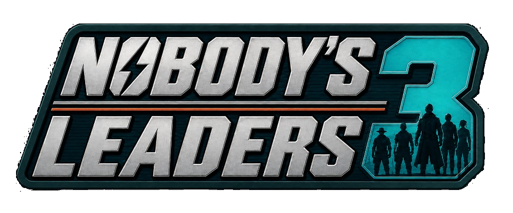

  

  <h1>Nobody's Leaders 3</h1>

  

    <strong>A complete Sim Settlements 2 leader pack and optional modern leader-selection panel.</strong>
  

  

    
    
    
  

  

    <a href="#overview">Overview</a> ·
    <a href="#features">Features</a> ·
    <a href="#download-options">Downloads</a> ·
    <a href="#requirements">Requirements</a> ·
    <a href="#installation">Installation</a> ·
    <a href="#support">Support</a>
  

---

## Overview

**Nobody's Leaders 3**, or **NBL3**, is a Sim Settlements 2 Leader Pack and a complete overhaul of Nobody's Leaders 2. It combines Fallout 4, DLC, and Sim Settlements 2 characters in one reviewed roster, with traits chosen to fit each character's role, skills, and personality.

The main ESP registers **146 leader cards** with Sim Settlements 2: **72 Fallout 4 and DLC characters** and **74 characters from Sim Settlements 2, Chapter 2, and Chapter 3**. The [NBL3 Leaders Sheet](https://docs.google.com/spreadsheets/d/1NsPlSrSbldQVzK8Z6ulcnFRZs1woYwue00RaQphGflQ/edit?gid=253869683#gid=253869683) provides the broader character reference, source links, and trait data.

NBL3 can be installed as a traditional leader pack. An optional F4SE and PrismaUI module replaces the City Planner's Desk leader picker with a responsive panel that shows the information needed to choose a leader without changing SS2's assignment rules.

## Features

- Adds 146 registered leader cards across Fallout 4, supported DLC, and all three SS2 chapters.
- Gives every NBL3 leader at least one major or minor trait; weaknesses remain optional.
- Shows major traits, minor traits, weaknesses, and their SS2 descriptions.
- Shows whether a character already leads a settlement.
- Shows settlement restrictions for leaders who can only lead specific settlements.
- Searches leaders by character, trait, assignment, restriction, and pack metadata.
- Filters installed leader packs and can place currently available leaders first.
- Supports fullscreen and windowed layouts from compact displays through 4K and 8K resolutions.
- Provides access to SS2's original barter-menu picker from inside the panel.
- Includes a leader-cache reset control for SS2 registration troubleshooting.
- Integrates Automatron and Vault-Tec Workshop support through soft-linked scripts without requiring separate DLC support plugins.

## Sim Settlements 2 behavior

NBL3 preserves SS2's leader system. The optional panel reads SS2's registered, available, and dead leader-card lists and follows SS2's normal checks and assignment sequence. Selecting the original SS2 picker takes the same `ShowLeaderSelect` path used by the City Planner's Desk.

The panel also lists leaders from other installed add-on and leader packs through SS2's normal registration system. Each pack is identified by its pack name and author. NBL3 does not remove or hide another pack's cards by default.

Kinggath was informed of the native interception used by the optional panel and granted permission for this approach. SS2 source files are not modified.

## Download options

The [Releases page](https://github.com/NOBOBYoO/NBL3/releases) provides two packages.

### SS2 — Nobody's Leaders 3

The traditional leader pack. It contains the main ESP and required Papyrus scripts and uses SS2's standard leader-selection interface.

### NBL3 F4SE

The complete leader pack plus the F4SE module, PrismaUI panel, and configuration. Install this package to use NBL3's leader browser.

SHA-256 checksum files are supplied with every download so the archives can be verified before installation.

## Requirements

Both packages require:

- [Fallout 4](https://store.steampowered.com/app/377160/Fallout_4/)
- [Workshop Framework](https://www.nexusmods.com/fallout4/mods/35004) **2.5.0 or newer**
- [Sim Settlements 2](https://www.nexusmods.com/fallout4/mods/47976) **3.6.0 or newer**, including Chapters 2 and 3 or the corresponding All Chapters Pack

The F4SE package additionally requires:

- [Fallout 4 Script Extender](https://f4se.silverlock.org/) for the installed game runtime
- [Address Library for F4SE Plugins](https://www.nexusmods.com/fallout4/mods/47327) for the installed game runtime
- [PrismaUI F4](https://www.nexusmods.com/fallout4/mods/105454) **2.1 or newer**
- Microsoft Visual C++ 2015–2022 Redistributable

The v0.1.0 native module declares support for Fallout 4 **1.10.163**, **1.10.980**, **1.10.984**, **1.11.137**, **1.11.159**, **1.11.169**, **1.11.191**, **1.11.221**, and **1.11.240**. Install matching versions of F4SE, Address Library, and other runtime-specific dependencies.

## Installation

### Vortex or Mod Organizer 2

1. Install the requirements for the selected package.
2. Download one NBL3 archive from the [Releases page](https://github.com/NOBOBYoO/NBL3/releases).
3. Install and enable it with the mod manager.
4. Confirm that `SS2_NobodysLeaders3.esp` is enabled.
5. With the F4SE package, launch Fallout 4 through F4SE.

Only install one NBL3 package. The F4SE archive already includes the complete leader pack.

### Manual installation

Extract the selected archive into the Fallout 4 `Data` directory while preserving its folder structure, then enable `SS2_NobodysLeaders3.esp`. Launch through F4SE when using the panel package.

### Leader registration

SS2 registers leader packs asynchronously. Newly installed or reset leaders may take several minutes, and heavily scripted saves can require several in-game days. Repeatedly pressing the reset button does not accelerate this process.

## Using the panel

Use **Assign or Replace City Leader** from an SS2 City Planner's Desk. NBL3 intercepts that option and presents the leader panel after the desk message closes.

- Select a card and choose **Assign as leader** to continue through SS2's normal assignment flow.
- Hover a trait, assignment, or settlement-limit tag to see its description.
- Use pack filters and search to narrow the roster.
- Choose fullscreen or windowed display mode in Settings.
- Choose **Open SS2 barter menu** to use SS2's original picker.
- Choose **Reset leaders cache** when SS2 has failed to register newly installed cards, then allow the rebuild time to finish.

## Support

- **Panel does not open:** confirm that Fallout 4 was launched through F4SE and that PrismaUI F4 2.1 or newer is installed.
- **Leader pack is missing:** confirm that the ESP and every SS2 chapter are enabled, then allow SS2's registration process to finish.
- **A leader remains unavailable:** NBL3 reflects SS2's own availability and settlement checks. Review the card's restrictions and character recruitment state.
- **Log location:** `Documents\My Games\Fallout4\F4SE\NBL3.log`.

When reporting a problem, include the exact Fallout 4 runtime, NBL3 version, `NBL3.log`, `f4se.log`, `PrismaUI_F4.log`, load order, affected leader or settlement, and reproduction steps.

## AI usage disclosure

AI tools are used during NBL3's development for automation, debugging, image generation, and implementation support. Design decisions, feature direction, review, testing, and release responsibility remain under the author's supervision.

## Credits

- [Sim Settlements 2](https://www.nexusmods.com/fallout4/mods/47976) — kinggath and the Sim Settlements 2 Team
- [Workshop Framework](https://www.nexusmods.com/fallout4/mods/35004) — kinggath
- [PrismaUI F4](https://www.nexusmods.com/fallout4/mods/105454) — StarkMP; Fallout 4 port by NomadsReach / Fallen World
- [Fallout 4 Script Extender](https://f4se.silverlock.org/) — Ian Patterson, Stephen Abel, and Brendan Borthwick
- [Address Library for F4SE Plugins](https://www.nexusmods.com/fallout4/mods/47327) — meh321
- [Independent Fallout Wiki](https://fallout.wiki/wiki/Fallout_Wiki) — Fallout character references
- [Sim Settlements 2 Wiki](https://wiki.simsettlements2.com/) — SS2 leader-system references

## Repository notice

This public repository contains NBL3 release information and approved player downloads. NBL3's source code is maintained privately and is not distributed from this repository.

See [LICENSE](LICENSE) for the terms that apply to the public release files.

---

  <strong>Nobody's Leaders 3</strong> 
  Choose the right leader without leaving SS2's rules behind.  
  <a href="https://github.com/NOBOBYoO/NBL3/releases">Releases</a> ·
  <a href="https://docs.google.com/spreadsheets/d/1NsPlSrSbldQVzK8Z6ulcnFRZs1woYwue00RaQphGflQ/edit?gid=253869683#gid=253869683">Leader Sheet</a>

